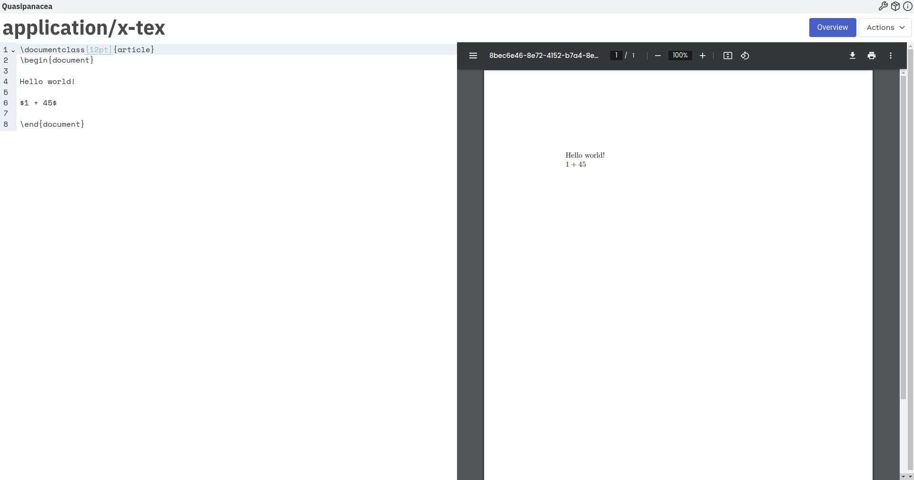

# Status

## overview-graph

Rudimentary plugin for working with a knowledge graph.

## pod-markdown

Rudimentary plugin for working with a Markdown document.

## pod-latex

Rudimentary plugin for working with a LaTeX documents.

## pod-excalidaraw

Rudimentary plugin for working with an Excalidraw drawing.

## settings-pod

Configure pod plugins for particular media types. For example, for a `text/markdown` document, one can choose either the 'markdown' or the 'milkdown' pod plugin.

