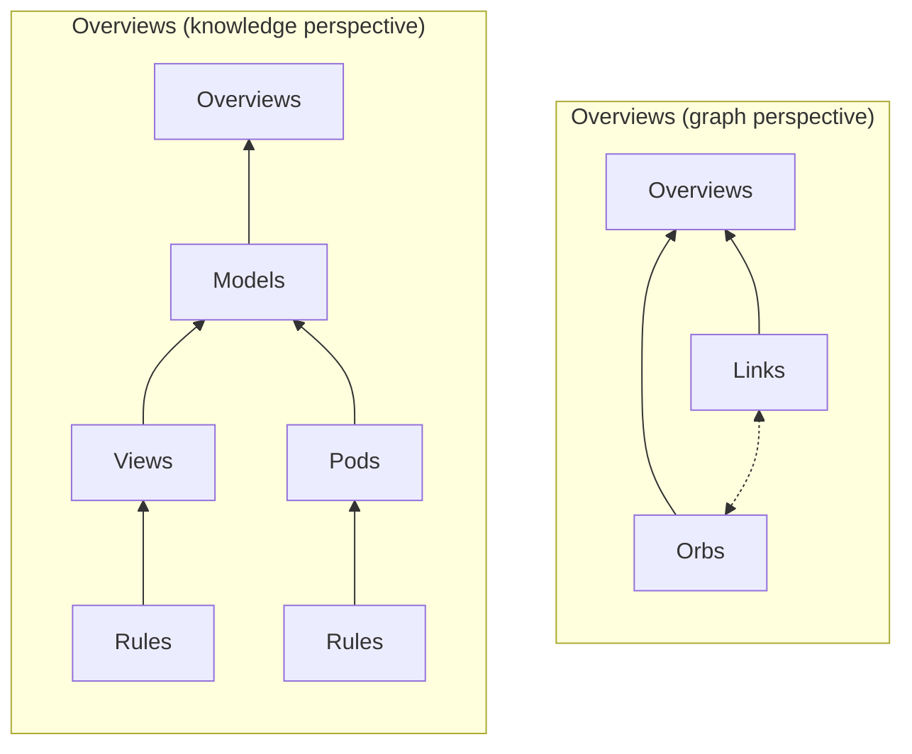

# Terminology

## Definitions

### overview

An _overview_ renders a knowledge repository. Most of the graph and relationship construction is delegated to _models_.

This concept exists as a first-class citizen so users can experiment with how _they_ display their knowledge.

### orb

Is a node on the knowledge graph.

- May have an associated pod (TODO)

### link

Is an edge on the knowledge graph.

- May have an associated pod

### pod

Responsible for managing data. Like a "Word Document", "Notion Page", or "Blender File".

A _pod_ is to documents as a class is to bytes.

There are _file_ pods and _directory_ pods.

For example, a `pdf` _file pod_ contains a `.pdf` file, and has functionality for reading, writing, and opening the pdf file.

For example, a `latex` _directory pod_, has not only a `.tex` file, but also its associated `.pdf`, `.sty`, `.png`, and other files.

### model

Is a node on the knowledge graph.

Models play a vital part in organizing data and their relationships. They:

- are a schema for knowledge to be constrained against
- have rules as additional constraints for orbs, pods, and the like
- have views for a set of faithful semantic representations of the schema
- store metadata of properties like: tags, authorship, last modified dates, etc.

### view

Responsible for representing knowledge of an model.

For example, an "Algebra View" may represent the topic of algebra. It may include links to algebra homework problems, algebra lecture notes, algebra lecture videos, and algebra cheat sheets, and other algebra-related "note groups". These different categories each have a set of associated pods.

Another example relates to productivity apps that have a kanban, calendar, and todo view. Each view would correspond to a view, and the data within those views are _conceptually_ stored in each model.

### rule

_Rules_ are constraints that enforce behavior. For example, one rule may enforce that pod names match a particular regular expression.

They are a core primitive that other pods, views, and models may use.

### plugin

Quasipanacea is highly extensible.

There are many different types of plugins:

- model
- view
- overview
- pack
- pod
- theme

## Definitions 2

- Analogue
